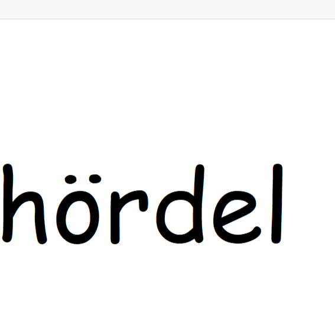

<a name="readme-top"></a>

[![LinkedIn][linkedin-shield]][linkedin-url]

[](https://www.buymeacoffee.com/aliceakesson)

<br />
<div align="center">
  <a href="https://github.com/aliceakesson/Heardle-Spotify/">
    
  </a>

  <h3 align="center">Heardle Spotify</h3>

  <p align="center">
    Heardle built on a Node.js server using Spotify's Web API
  </p>
</div>

<!-- ABOUT THE PROJECT -->
## About The Project

<p>
This is another version of Heardle made completely by me, where the user can choose freely regarding choice of music. For example: song by artist, song by playlist or a song from the user's top songs.
</p>

<br><br>

<div style="display: flex;justify-content: center;align-items: center;margin:auto">
  
  
</div>

<br><br>

## Requirements

Sadly, this project requires the user to have some sort of Spotify Premium membership. This is because, as for now, you will need to start your own Spotify Application to play it (more about this in the installation guide further down).

## Built With

<p>
The site runs on a local host, made using Node.js. Further, it's built using Spotify's Web API and the Spotify Web Playback SDK, where the user will have to authenticate using <a href="https://datatracker.ietf.org/doc/html/rfc6749">OAuth 2.0</a>. 
</p>

* [![Node][node-shield]][node-url]
* [![JavaScript][js-shield]][js-url]
* [![HTML][html-shield]][html-url]
* [![CSS][css-shield]][css-url]


## Installation

As mentioned in the requirements, you will first need to create your own Spotify Application. This is easily done through <a href="https://developer.spotify.com/dashboard">the Spotify Dashboard</a>. The steps are as following: 

1. Click on "Create app"
2. Give the app a name (any) and a short description
3. Leave the textfield for "Website" blank. This is not needed
4. Enter 'http://localhost:8888/callback' for the redirect URL
5. Check the terms of service box 
6. Click on "Save"

Now, proceed to download and extract the zip-file of this GitHub project. Open the project in any code editor and locate the environment-file (.env) which is located in the 'public' folder. The values for CLIENT_ID and CLIENT_SECRET can be found by clicking on the settings of your Spotify Application (The client secret will be visible by clicking on "View client secret"). Enter these values for their respective variables in the environment. 

> **Note:** The values should not be written inside string literals, they should just be inserted as they are (eg. CLIENT_ID=1234567890, not CLIENT_ID="1234567890")

The application requires you to run it on a local server (this is done using Node.js and nodemon), thus you will therefore afterwards have to download these. In the your terminal, go to the directory of the project and then go to the folder named 'public' using this command: 

```sh
  cd public
  ```  
> **Note:** This command is based off of the Windows terminal. It may vary depending on the operative system.

After that, install npm and nodemon in the current folder using the following two commands: 

```sh
  npm install 
  ```

```sh
  npm install -g nodemon
  ```
  
 If everything goes well, the application should then be playable by calling the command to start the server, then open up the server in your browser of choice at <a>http://localhost:8888/login</a>.
 
 ```sh
  nodemon server.js
  ```

It can be exited at anytime by using Ctrl+C in the terminal, or be refreshed by simply writing the following: 

```sh
  rs
  ```

<!-- CONTACT -->
## Contact

Alice Åkesson - alicek732@gmail.com

Project Link: [https://github.com/aliceakesson/Heardle-Spotify](https://github.com/aliceakesson/Heardle-Spotify)

[css-shield]: https://img.shields.io/badge/CSS-239120?&style=for-the-badge&logo=css3&logoColor=white
[css-url]: https://www.w3.org/Style/CSS/Overview.en.html
[html-shield]: https://img.shields.io/badge/HTML-239120?style=for-the-badge&logo=html5&logoColor=white
[html-url]: https://html.com/
[js-shield]: https://img.shields.io/badge/JavaScript-F7DF1E?style=for-the-badge&logo=javascript&logoColor=black
[js-url]: https://www.javascript.com/
[linkedin-shield]: https://img.shields.io/badge/-LinkedIn-black.svg?style=for-the-badge&logo=linkedin&colorB=555
[linkedin-url]: https://www.linkedin.com/in/alice-%C3%A5kesson-20a066215/
[node-shield]: https://img.shields.io/badge/Node.js-43853D?style=for-the-badge&logo=node.js&logoColor=white
[node-url]: https://nodejs.org/en
